# Report about CAPA tool

### Contributors
- Mohamed halim ELLEUCH  
- Imen CHIHAOUI  
- Jasser DHIEB

### From a static analysis view : 
1. General introduction : 

CAPA is a new open source tool that analyzes a program and identifies the things that it thinks that the program could do we call these “capabilities” and it uses rules that are written by experts to recognize these capabilities
That means capa is expert driven by these rules and so it can be easily explained to other human beings the results ! it also has an extensible rule set which means that capa is always learning new capabilities and new things that might be seen as malware.
Input : rules written by experts
Output : Capabilities (informations that may be useful to identify a malware) 
These rules are designed in a way to be easily digestible by a human!

 2. How does it work ? 

Capa is a command line tool which means we just need to invoke it
from the command line in the terminal and we'll just run capa point it to our program and we'll see that it analyzes for a couple seconds its processing doing a lot of really hard work and then it will display those results to us!

 3. Runnig CAPA:

here we tried to run an example and describe what we have found : 
At first we tried to run capa on a binary file to see how it works !

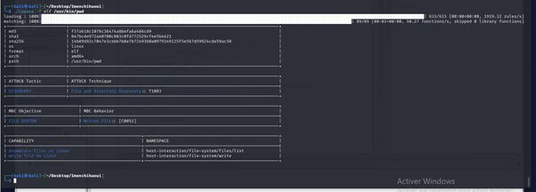

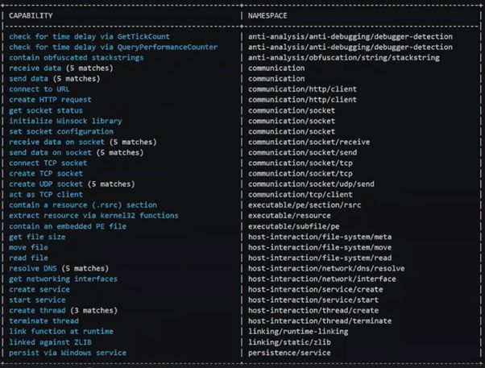

In this example we can see  that this program might be able to send and receive data connect to a url with an http request i see that it can manipulate files on the file system and persist via windows service.

4.  Problems in CAPA : 

We faced some problems running capa commands in a python script. Most of them have been updated and changed. Like, when we tried to test rules with python script , we didn’t find the command to do it.  
One of the problems faced in capa is that it requires a specific type of file. It doesnt work with Packers


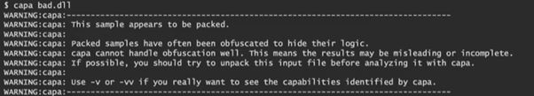


### From dynamic analysis view : 

1. The main idea : 

Dynamic program analysis consists in examining a program's behavior by processing information captured at execution time. So, We will try to make capa work with dynamic analysis rules !
The main idea is to find patterns that correspond to dynamic capabilities by intercepting the API calls which will help us gain an overview of the behavior of the program then we put them(the patterns) in rules files and finally give a rule file as option “--rules a_rule_file” to capa and run it to see the dynamic capabilities will correspond to a malware or not.

2. Dealing with API traces (the pickle file) : 

we have collected informations from the pickle files, specifically about the calls that had been made during the execution of malware files :

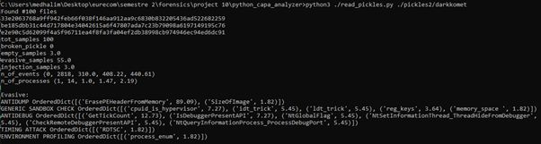
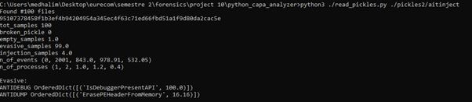
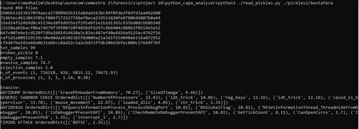
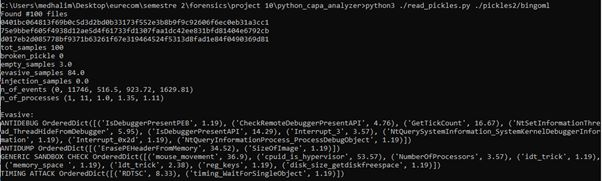
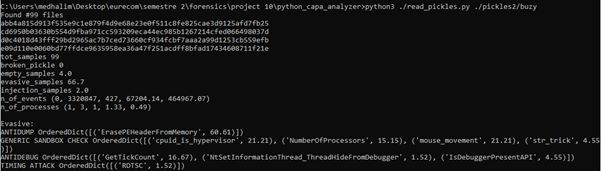
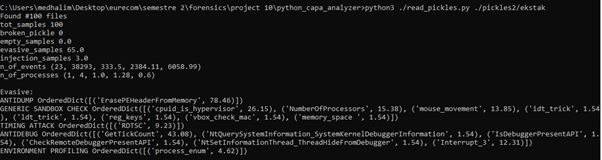
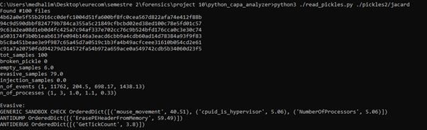
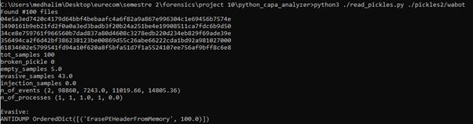

based on the informations that we got from the pickle files we understood that the evasive techniques, which were grouped by a specific categories, they contain the malicious apis detected, so we tried to create some rules based on those evasive techniques and apis like this example below:

evasive techniques and apis extracted from the pickle files:
```
GENERIC SANDBOX CHECK OrderedDict([('reg_keys', 12.16), ('cpuid_is_hypervisor', 33.78), ('ldt_trick', 14.86), ('idt_trick', 12.16), ('mouse_movement', 22.97), ('NumberOfProcessors', 32.43), ('loaded_dlls', 4.05), ('str_trick', 1.35)])
GENERIC SANDBOX CHECK OrderedDict([('mouse_movement', 36.9), ('cpuid_is_hypervisor', 53.57), ('NumberOfProcessors', 3.57), ('disk_size_getdiskfreespace', 1.19), ('memory_space ', 1.19), ('idt_trick', 1.19), ('ldt_trick', 2.38), ('reg_keys', 1.19)])
GENERIC SANDBOX CHECK OrderedDict([('cpuid_is_hypervisor', 20.9), ('mouse_movement', 20.9), ('NumberOfProcessors', 14.93), ('str_trick', 4.48)])
GENERIC SANDBOX CHECK OrderedDict([('idt_trick', 5.45), ('ldt_trick', 5.45), ('cpuid_is_hypervisor', 7.27), ('reg_keys', 3.64), ('memory_space ', 1.82)])
GENERIC SANDBOX CHECK OrderedDict([('NumberOfProcessors', 15.38), ('cpuid_is_hypervisor', 26.15), ('ldt_trick', 1.54), ('reg_keys', 1.54), ('idt_trick', 1.54), ('mouse_movement', 13.85), ('vbox_check_mac', 1.54), ('memory_space ', 1.54)])
```
specific rule for this specific evasive technique: 
```yml
rule:
  meta:
    name: GENERIC_SANDBOX_CHECK
  features:
    - or : 
         - api: reg_keys
         - api: cpuid_is_hypervisor
         - api: ldt_trick
         - api: idt_trick
         - api: mouse_movement
         - api: NumberOfProcessors
         - api: loaded_dlls
         - api: str_trick
         - api: disk_size_getdiskfreespace
         - api: memory_space
         - api: vbox_check_mac
```


and with this we could detect malicious dynamic behavior based on these extracted rules, using CAPA tool.

in here we tried to use the rules on a normal binary file, just to make sure that the rules work fine:   

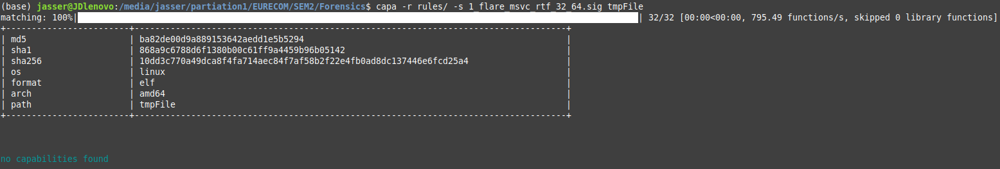

we also have found a [database](https://bazaar.abuse.ch/) of malware that could be used to test our rules.

References : 

https://blog.quarkslab.com/exploring-execution-trace-analysis.html  
https://opensource.com/article/21/10/linux-elf-capa   
https://www.youtube.com/watch?v=cbmMstmsq9c&ab_channel=SANSDigitalForensicsandIncidentResponse   
https://bazaar.abuse.ch/
